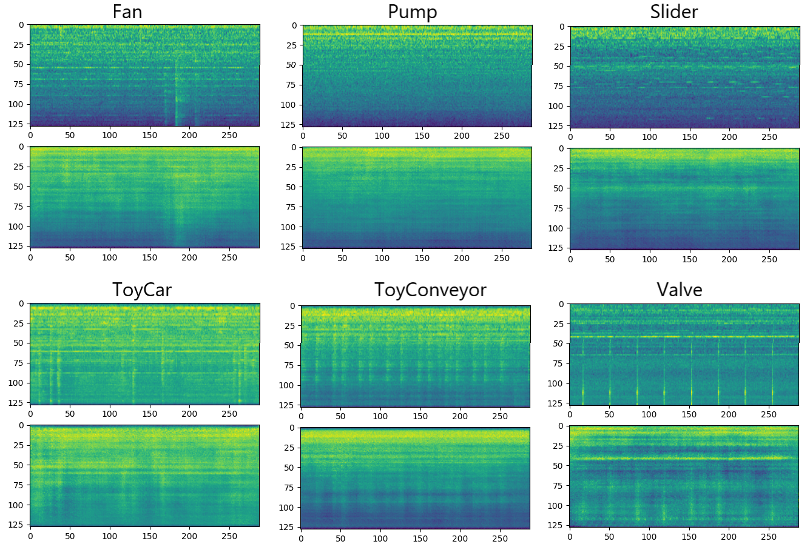
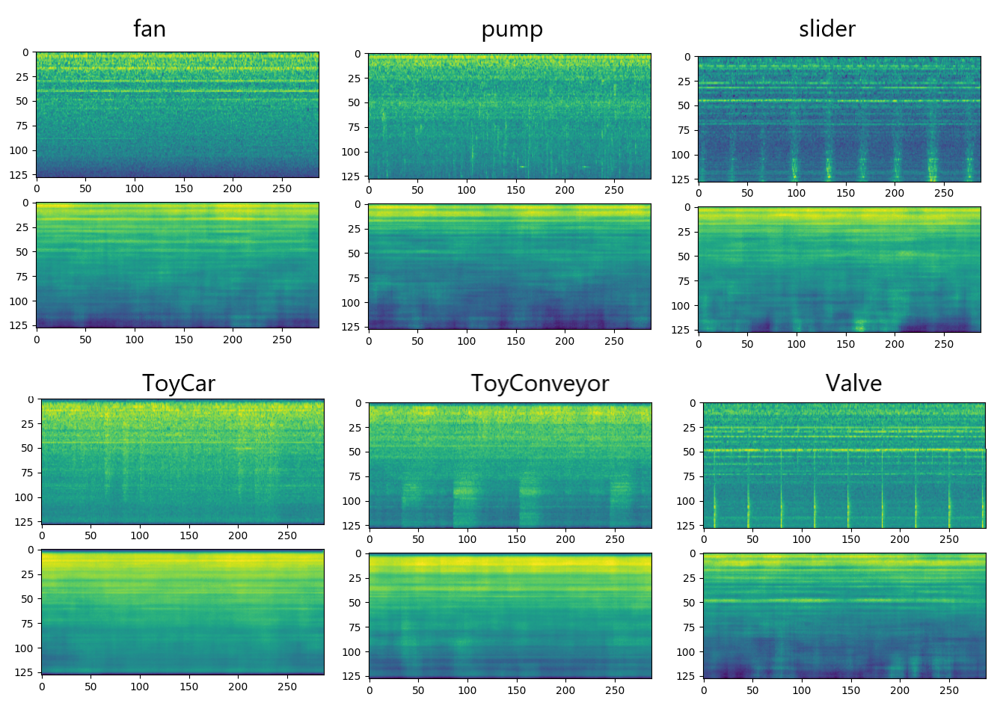

[English](./README.md) | [简体中文](README_cn.md)

# ConvolutionalVAE_withConditional
This repository provides the implementation of Convolutional VAE and conditional variational autoencoders.

### Dataset：DCASE2020 contraining 20000 waveform
Each piece of data is a 10s audio, converted to MelSpectrogram, the shape is (128, 288), and the model input is (batch_size, 1, 288, 128).

# VAE

It's very important to set parameters as follow: Adam learning rate: 0.001, kl_weight=0.00025, scheduler.CosineAnnealing(t_max=5)

```text
self.model = get_model("cvae", configs=self.configs, istrain=True,
                               params={"latent_dim": self.latent_dim, "conditional": False, "num_labels": 6}).to(self.device)
```

Run
```commandline
python trainer_cvae.py
```
run trainer will create a save dictionary as "./run/VAE/{datetime}/" to save model and reconstructed mel spectrogram.

Reconstruction Result of VAE:



# Conditional VAE

```text
self.model = get_model("cvae", configs=self.configs, istrain=True,
                               params={"latent_dim": self.latent_dim, "conditional": True, "num_labels": self.class_num}).to(self.device)
```
Reconstruction Result of ConditionalVAE:


