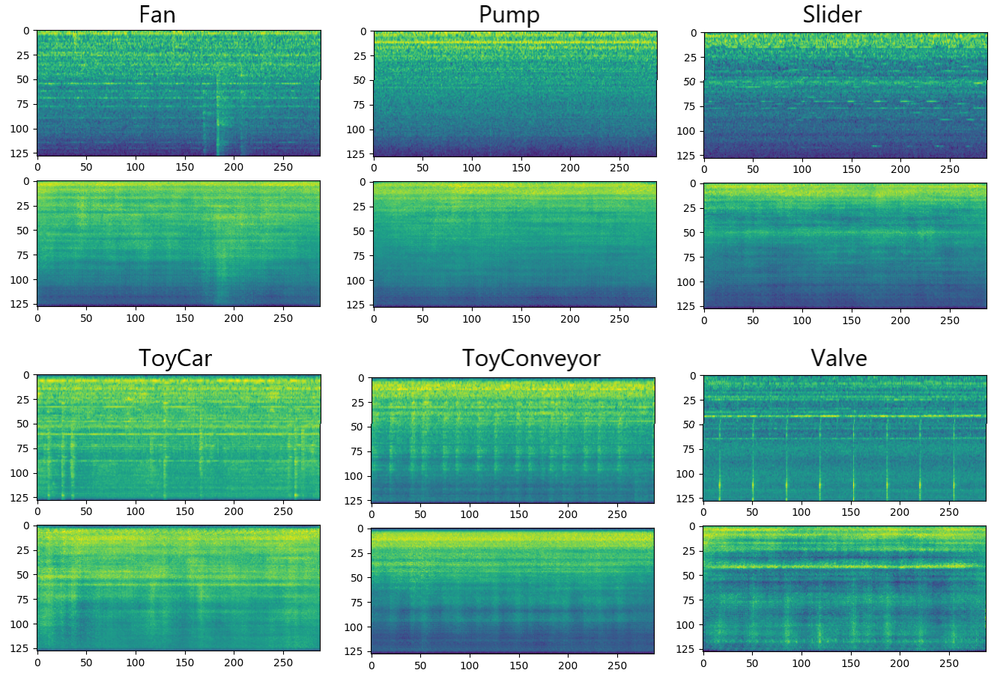
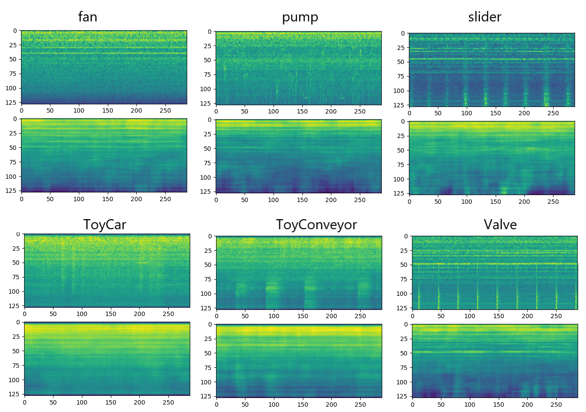

[English](./README.md) | [简体中文](README_cn.md)

# 变分自编码器VAE(通过CNN实现，以及条件变分自编码器CVAE版本)
本仓库提供 Convolutional VAE的实现，以及条件变分自编码器。

### Dataset：DCASE2020 contraining 20000 waveform
每条数据是一条10s的音频，转换为MelSpectrogram，shape为(128, 288)，模型输入为(batch_size, 1, 288, 128)。

# VAE

```text
self.model = get_model("cvae", configs=self.configs, istrain=True,
                               params={"latent_dim": self.latent_dim, "conditional": False, "num_labels": 6}).to(self.device)
```

运行训练
```commandline
python trainer_cvae.py
```
运行trainer程序将会创建一个目录"./run/VAE/{datetime}/" 来存储每一个epoch训练的模型和重构频谱图。

VAE的重构结果:



# Conditional VAE

```text
self.model = get_model("cvae", configs=self.configs, istrain=True,
                               params={"latent_dim": self.latent_dim, "conditional": True, "num_labels": self.class_num}).to(self.device)
```
条件变分自编码器的重构结果:


